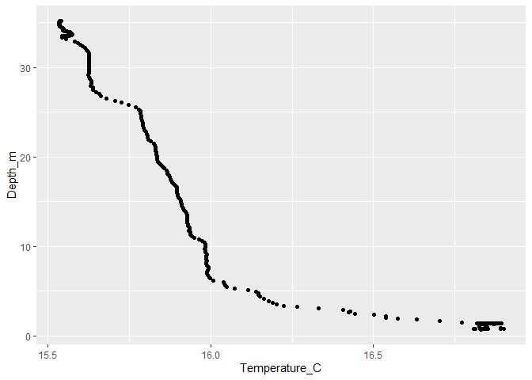
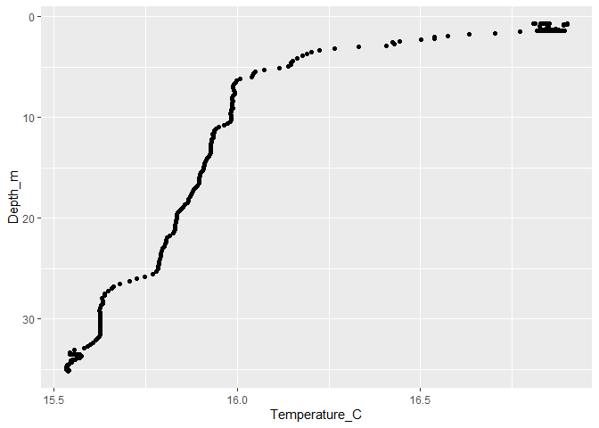
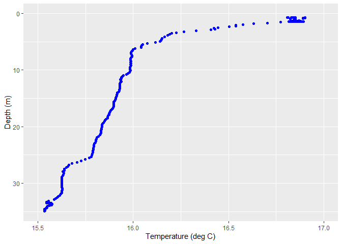
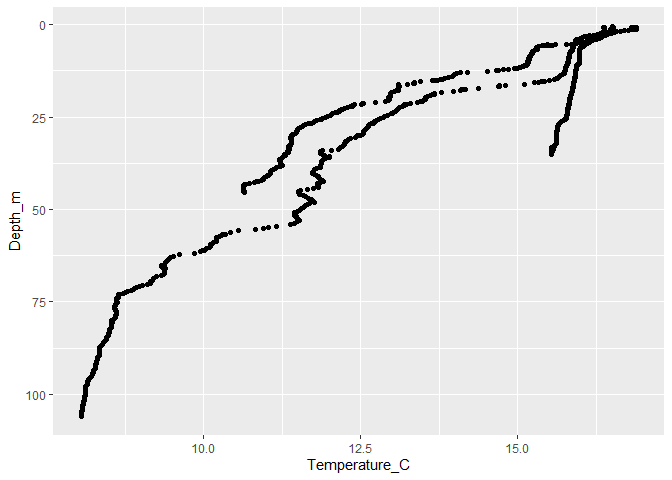
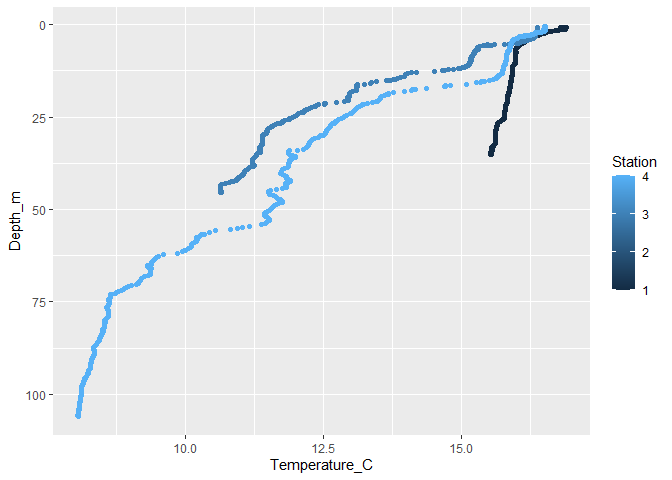
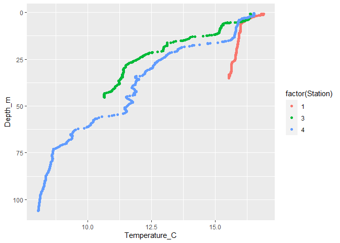

Lab 2 B: Introduction to working with oceanographic data
================

# Lab Assignment

Import the DaRTS CTD data and create the 3 following figures:

1.  A temperature profile for Station 1 from the Cruise on Sept
    11th 2012.

2.  Temperature profiles for all the Stations from the Cruise on Sept
    11th 2012, with all profiles on the same plot.

3.  Profiles from all the stations for a cruise and variable of your
    choice.

We’re going to walk through the steps to make these together.

# Formatting Data

We all have a copy of the DaRTS data. This is a large Excel file, with
lots of different sheets and some formatting issues that R doesn’t like.
Before we import the data into R, we need to make it R friendly.

1.  Download the DaRTS\_cruise\_data\_2012-2020 – 20201103.xlsx from the
    Course1/Labs/Lab02/ Google Drive folder.
2.  Save the DaRTS file in a sensible location (e.g. your lab2 folder)
3.  Open DaRTS\_cruise\_data\_2012-2020 – 20201103.xlsx
4.  Go to the “CTD all years” sheet

If you opened the file in Excel: 3. Go to “File” -&gt; “Save As” and
select to save the file as a “CSV (Comma delimited)” file named
DaRTS\_CTD\_data (selecting “yes”" to the windows that pop up) 4. Exit
the Excel file (selecting “no” you don’t want to save changes if asked.)
5. Open the csv file you just created in Excel (the easiest way to do
this is open Excel, then do “File” -&gt; “Open” -&gt; “Browse”, then
navigate to the file and select “Open”)

If you opened the file in Numbers: 1. Go to “File” -&gt; “Export To”
-&gt; CSV 2. Check the box that says “Create a file for every table”.
You are going to create a CSV file for every sheet (table) in the file.
You will be asked to name the folder all the CSV files will be saved in
- pick something sensible! 3. Once saved, exit the numbers file. 3. Copy
the CSV file for the “CTD all years” sheet to your labs folder
directory. 5. Open the csv file you just created.

Once you’ve opened the CSV file 5. Combine the information in the first
two rows into the top row. Delete the 2nd row and remove the notes that
are to the right hand side of the data 6. Remove units (and spaces) from
column names, change “Beam” to “BeamC” and the last two columns to
“O2Conc” and “O2Saturation” 7. Save and close the csv file.

You should be left with a rectangular block of numbers, with the first
row as “headers” or column names.

# Setting up your R session

1.  Create a new script and save it as “Lab2-workingWithData”
2.  Check your working directory has both your script and the
    DaRTS\_CTD\_data.csv file
3.  Start the script by importing the libraries we are going to need. To
    do this, type the following at the start of your script:

``` r
library("tidyverse")
```

    ## -- Attaching packages ------------ tidyverse 1.3.0 --

    ## v ggplot2 3.3.2     v purrr   0.3.4
    ## v tibble  3.0.3     v dplyr   1.0.2
    ## v tidyr   1.1.2     v stringr 1.4.0
    ## v readr   1.3.1     v forcats 0.5.0

    ## -- Conflicts --------------- tidyverse_conflicts() --
    ## x dplyr::filter() masks stats::filter()
    ## x dplyr::lag()    masks stats::lag()

All the R commands below should be typed into your script and run from
there.

# Importing Data into R

Let’s read in the data:

``` r
DATA<- read.csv("DaRTS_CTD_data.csv",header = TRUE)
```

An object DATA should appear in your Environment panel. If you double
click on the DATA object, it should open in a new pane, and you can see
all the data.

This type of object is called a **data frame** - it’s just like a table
of data.

# Wrangling Data

The first plot we wanted to make was a profile of temperature from
Station 1 from the Cruise on Sept 11th 2012. So we need to pull out from
our data frame the relevant rows of data - this is a process known as
**filtering**.

If we check our DATA object, we can see the dates are in the format of
YYYYMMDD. So we need to select the rows that have a value of 20120911 in
the `Date` column and a value of 1 in the `Station` column.

``` r
# filtering by cruise first
cruiseData <- dplyr::filter(DATA, Date == 20120911)

# next filtering by station
stnData <- dplyr::filter(cruiseData, Station == 1)

# filter by both together
subData <- dplyr:: filter(DATA, Date == 20120911 & Station == 1)
```

# Plotting Data

We are going to use the tidyverse package called ggplot to make our
figures. The way ggplot works is we have to first tell R what data we
want to plot, then we tell it the style of plot we’d like:

``` r
ggplot(stnData, aes(x=Temperature_C, y=Depth_m)) +
  geom_point()
```

<!-- -->
Normally we’d plot this with the y-axis in the other direction:

``` r
ggplot(stnData, aes(x=Temperature_C, y=Depth_m)) +
  geom_point() +
  scale_y_reverse()
```

<!-- -->

We can change how this plot looks by including some arguments to the
`geom_point()` function, and including some more functions:

``` r
ggplot(stnData, aes(x=Temperature_C, y=Depth_m)) + 
  geom_point(color='blue') + 
  xlab('Temperature (deg C)') +
  ylab('Depth (m)') + 
  xlim(15.5,17) + 
  ylim(35,0)
```

    ## Warning: Removed 24 rows containing missing values (geom_point).

<!-- -->

We received a warning because some of the data were outside of the axis
limits we selected.

There are lots of other types of plots and ways to edit your plots using
ggplot. Check out these [cheat sheets for a
summary](https://github.com/rstudio/cheatsheets/blob/master/data-visualization-2.1.pdf).

# Warning messages vs Error messages

**Warning message:** code has run, but something wasn’t quite right

**Error:** code didn’t run at all. The error message gives you
information about what went wrong.

StackOverFlow (& Google) are a great tool for figuring out error
messages

# Saving a figure

To save a plot, we can use the `ggsave` command:

``` r
ggsave('temperature profile from 20120911.png')
```

    ## Saving 7 x 5 in image

    ## Warning: Removed 24 rows containing missing values (geom_point).

# Multiple plots on one figure

Now we want to tackle the next part of the assignment:

**Plot temperature profiles for all the Stations from the Cruise on Sept
11th 2012, with all profiles on the same plot.**

In this case, we need all the data from the cruise on Sept 11th 2012. So
we need to filter our original data frame (DATA) for those rows. But -
we did this already! And when we did it earlier we assigned it to the
object called `cruiseData` - check that object is in your Enviornment
panel.

So we can make a plot just like before, but call the `cruiseData` data
frame.

``` r
ggplot(cruiseData, aes(x=Temperature_C, y=Depth_m)) +
  geom_point() +
  scale_y_reverse()
```

<!-- -->
Great - we have three profiles! But it would be nice to color each
profile based on which station it is. The trick here is telling R to
color the dots on our plot based on station number. So we need to add an
extra piece of information into our `ggplot` call:

``` r
ggplot(cruiseData, aes(x=Temperature_C, y=Depth_m, color=Station)) +
  geom_point() +
  scale_y_reverse()
```

<!-- -->
Is there something you notice about how the colors are represented?

They are picked from a continuous color bar, rather than separate
distinct colors. That is because R knows they are numbers, and so
chooses a color scale, and selects the color for each station based on
it’s numerical value (and spacing) on the color scale. As far as R is
aware, Station could have a value of 0.5, or 2.1, or 3.99999. We want R
to treat the station numbers as distinct, separate items
(i.e. **discrete** values) not as **continuous** values. To do that, we
have to convert those values to **factors**. To us, the values won’t
*look* different - but R knows the difference.

We’ll look at a small example

``` r
x <- c(1,2,3,4)
typeof(x)
```

    ## [1] "double"

``` r
xf <- factor(x)
typeof(xf)
```

    ## [1] "integer"

OK - so how do we include this factor conversion in our plot?

``` r
ggplot(cruiseData, aes(x=Temperature_C, y=Depth_m, color=factor(Station))) +
  geom_point() +
  scale_y_reverse()
```

<!-- -->
And finally - let’s save this plot!

``` r
ggsave('temperature profiles for all stations from 20120911.png')
```

    ## Saving 7 x 5 in image
