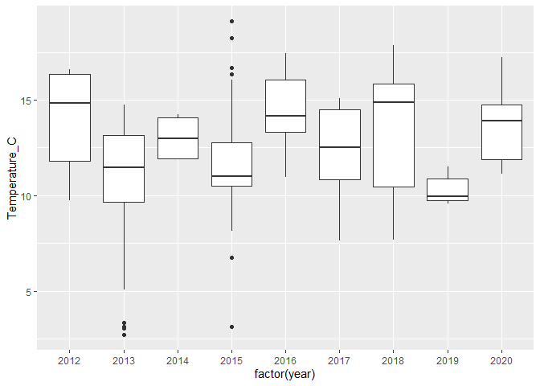
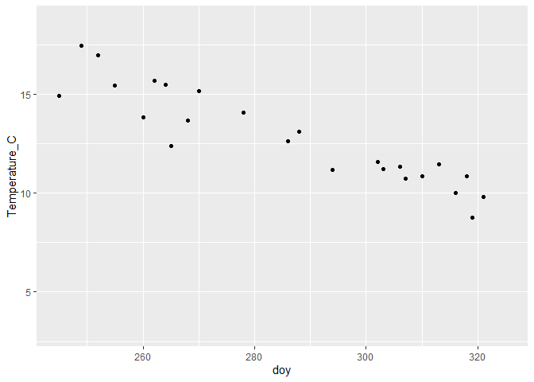
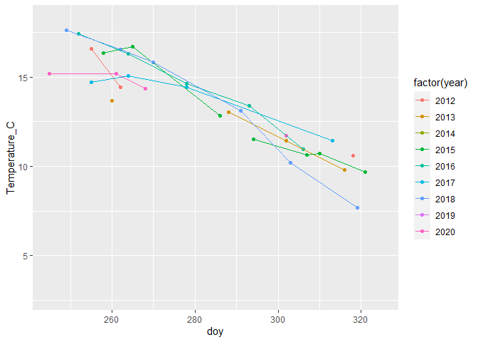
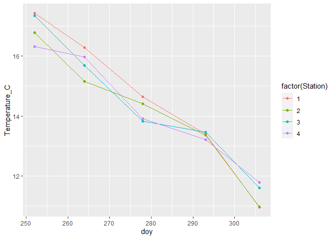
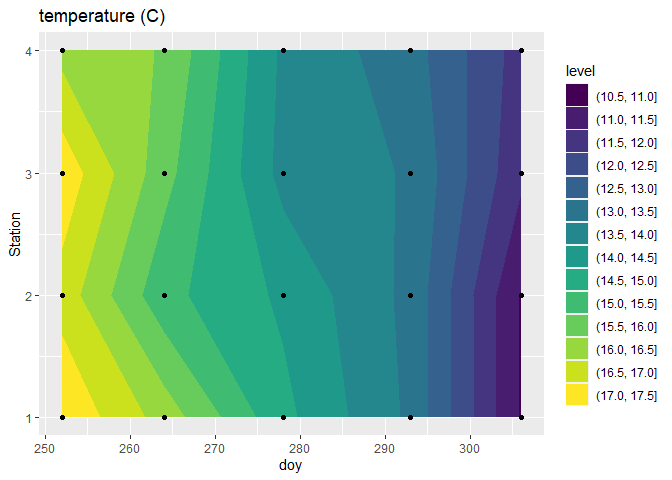

Lab 3: Assignment Plots
================

1.  What is the overall change year-on-year? (Hint: plot the temperature
    distribution for each year as a boxplot)
2.  What is the mean seasonal temperature cycle within a year?
3.  What is the seasonal change at Station 1? Show each year in a
    different color.
4.  What is the seasonal change in temperature at all stations during
    2016?

# Initializing

``` r
setwd("C:/Users/cmitchell/Documents/SeaChangeSemester/2021/Labs/sea-change-semester-data-labs/Lab03/")

library(dplyr)
```

    ## Warning: package 'dplyr' was built under R version 4.0.5

    ## 
    ## Attaching package: 'dplyr'

    ## The following objects are masked from 'package:stats':
    ## 
    ##     filter, lag

    ## The following objects are masked from 'package:base':
    ## 
    ##     intersect, setdiff, setequal, union

``` r
library(ggplot2)
```

    ## Warning: package 'ggplot2' was built under R version 4.0.5

``` r
library(lubridate)
```

    ## Warning: package 'lubridate' was built under R version 4.0.5

    ## 
    ## Attaching package: 'lubridate'

    ## The following objects are masked from 'package:base':
    ## 
    ##     date, intersect, setdiff, union

# Importing data sets

``` r
ctdData <- read.csv('DaRTS_CTD_data.csv')
discreteData <- read.csv('DaRTS_discrete_data.csv')
```

# Data wrangling

## Dates

``` r
ctdData <- mutate(ctdData, Date = ymd(ctdData$Date))

discreteData <- mutate(discreteData, Date = mdy(discreteData$Date))

ctdData <- ctdData %>% 
  mutate(year = year(ctdData$Date),
         month = month(ctdData$Date),
         day = day(ctdData$Date),
         doy = yday(ctdData$Date))

discreteData <- discreteData %>% 
  mutate(year = year(discreteData$Date),
         month = month(discreteData$Date),
         day = day(discreteData$Date),
         doy = yday(discreteData$Date))
```

## Depths

``` r
ctdData <- ctdData %>% mutate(Depth_m = round(ctdData$Depth_m))

ctdDataBinned <- ctdData %>% 
  group_by(Date, Station, Depth_m) %>% 
  summarize_all(mean, na.rm = TRUE)
```

## Combining datasets

``` r
combinedData <- ctdDataBinned %>%
  full_join(discreteData)
```

    ## Joining, by = c("Date", "Station", "Depth_m", "year", "month", "day", "doy")

# Plotting

Surface data needed for plotting

``` r
surfaceData <- combinedData %>%
  filter(Depth_m == 2)
```

## Plot 1

``` r
ggplot(surfaceData, 
       aes(x=factor(year), y= Temperature_C)) +
  geom_boxplot()
```

    ## Warning: Removed 46 rows containing non-finite values (stat_boxplot).

<!-- -->

## Plot 2

``` r
surfaceData %>% group_by(doy) %>%
  summarize_all(mean) %>%
  ggplot(aes(x=doy, y= Temperature_C)) +
  geom_point() +
  xlim(245,325)
```

    ## Warning in mean.default(Lat): argument is not numeric or logical: returning NA

    ## Warning in mean.default(Lat): argument is not numeric or logical: returning NA

    ## Warning in mean.default(Lat): argument is not numeric or logical: returning NA

    ## Warning in mean.default(Lat): argument is not numeric or logical: returning NA

    ## Warning in mean.default(Lat): argument is not numeric or logical: returning NA

    ## Warning in mean.default(Lat): argument is not numeric or logical: returning NA

    ## Warning in mean.default(Lat): argument is not numeric or logical: returning NA

    ## Warning in mean.default(Lat): argument is not numeric or logical: returning NA

    ## Warning in mean.default(Lat): argument is not numeric or logical: returning NA

    ## Warning in mean.default(Lat): argument is not numeric or logical: returning NA

    ## Warning in mean.default(Lat): argument is not numeric or logical: returning NA

    ## Warning in mean.default(Lat): argument is not numeric or logical: returning NA

    ## Warning in mean.default(Lat): argument is not numeric or logical: returning NA

    ## Warning in mean.default(Lat): argument is not numeric or logical: returning NA

    ## Warning in mean.default(Lat): argument is not numeric or logical: returning NA

    ## Warning in mean.default(Lat): argument is not numeric or logical: returning NA

    ## Warning in mean.default(Lat): argument is not numeric or logical: returning NA

    ## Warning in mean.default(Lat): argument is not numeric or logical: returning NA

    ## Warning in mean.default(Lat): argument is not numeric or logical: returning NA

    ## Warning in mean.default(Lat): argument is not numeric or logical: returning NA

    ## Warning in mean.default(Lat): argument is not numeric or logical: returning NA

    ## Warning in mean.default(Lat): argument is not numeric or logical: returning NA

    ## Warning in mean.default(Lat): argument is not numeric or logical: returning NA

    ## Warning in mean.default(Lat): argument is not numeric or logical: returning NA

    ## Warning in mean.default(Lat): argument is not numeric or logical: returning NA

    ## Warning in mean.default(Lat): argument is not numeric or logical: returning NA

    ## Warning in mean.default(Lat): argument is not numeric or logical: returning NA

    ## Warning in mean.default(Lat): argument is not numeric or logical: returning NA

    ## Warning in mean.default(Lat): argument is not numeric or logical: returning NA

    ## Warning in mean.default(Lat): argument is not numeric or logical: returning NA

    ## Warning in mean.default(Lat): argument is not numeric or logical: returning NA

    ## Warning in mean.default(Lat): argument is not numeric or logical: returning NA

    ## Warning in mean.default(Lat): argument is not numeric or logical: returning NA

    ## Warning in mean.default(Lat): argument is not numeric or logical: returning NA

    ## Warning in mean.default(Lat): argument is not numeric or logical: returning NA

    ## Warning in mean.default(Lat): argument is not numeric or logical: returning NA

    ## Warning in mean.default(Lat): argument is not numeric or logical: returning NA

    ## Warning in mean.default(Lat): argument is not numeric or logical: returning NA

    ## Warning in mean.default(Lat): argument is not numeric or logical: returning NA

    ## Warning in mean.default(Lat): argument is not numeric or logical: returning NA

    ## Warning in mean.default(Lat): argument is not numeric or logical: returning NA

    ## Warning in mean.default(Lat): argument is not numeric or logical: returning NA

    ## Warning in mean.default(Lat): argument is not numeric or logical: returning NA

    ## Warning in mean.default(Lat): argument is not numeric or logical: returning NA

    ## Warning in mean.default(Lat): argument is not numeric or logical: returning NA

    ## Warning in mean.default(Lat): argument is not numeric or logical: returning NA

    ## Warning in mean.default(Lat): argument is not numeric or logical: returning NA

    ## Warning in mean.default(Lat): argument is not numeric or logical: returning NA

    ## Warning in mean.default(Lat): argument is not numeric or logical: returning NA

    ## Warning in mean.default(Lat): argument is not numeric or logical: returning NA

    ## Warning in mean.default(Lat): argument is not numeric or logical: returning NA

    ## Warning in mean.default(Lat): argument is not numeric or logical: returning NA

    ## Warning in mean.default(Lat): argument is not numeric or logical: returning NA

    ## Warning in mean.default(Lat): argument is not numeric or logical: returning NA

    ## Warning in mean.default(Lat): argument is not numeric or logical: returning NA

    ## Warning in mean.default(Lat): argument is not numeric or logical: returning NA

    ## Warning in mean.default(Lat): argument is not numeric or logical: returning NA

    ## Warning in mean.default(Lat): argument is not numeric or logical: returning NA

    ## Warning in mean.default(Long): argument is not numeric or logical: returning NA

    ## Warning in mean.default(Long): argument is not numeric or logical: returning NA

    ## Warning in mean.default(Long): argument is not numeric or logical: returning NA

    ## Warning in mean.default(Long): argument is not numeric or logical: returning NA

    ## Warning in mean.default(Long): argument is not numeric or logical: returning NA

    ## Warning in mean.default(Long): argument is not numeric or logical: returning NA

    ## Warning in mean.default(Long): argument is not numeric or logical: returning NA

    ## Warning in mean.default(Long): argument is not numeric or logical: returning NA

    ## Warning in mean.default(Long): argument is not numeric or logical: returning NA

    ## Warning in mean.default(Long): argument is not numeric or logical: returning NA

    ## Warning in mean.default(Long): argument is not numeric or logical: returning NA

    ## Warning in mean.default(Long): argument is not numeric or logical: returning NA

    ## Warning in mean.default(Long): argument is not numeric or logical: returning NA

    ## Warning in mean.default(Long): argument is not numeric or logical: returning NA

    ## Warning in mean.default(Long): argument is not numeric or logical: returning NA

    ## Warning in mean.default(Long): argument is not numeric or logical: returning NA

    ## Warning in mean.default(Long): argument is not numeric or logical: returning NA

    ## Warning in mean.default(Long): argument is not numeric or logical: returning NA

    ## Warning in mean.default(Long): argument is not numeric or logical: returning NA

    ## Warning in mean.default(Long): argument is not numeric or logical: returning NA

    ## Warning in mean.default(Long): argument is not numeric or logical: returning NA

    ## Warning in mean.default(Long): argument is not numeric or logical: returning NA

    ## Warning in mean.default(Long): argument is not numeric or logical: returning NA

    ## Warning in mean.default(Long): argument is not numeric or logical: returning NA

    ## Warning in mean.default(Long): argument is not numeric or logical: returning NA

    ## Warning in mean.default(Long): argument is not numeric or logical: returning NA

    ## Warning in mean.default(Long): argument is not numeric or logical: returning NA

    ## Warning in mean.default(Long): argument is not numeric or logical: returning NA

    ## Warning in mean.default(Long): argument is not numeric or logical: returning NA

    ## Warning in mean.default(Long): argument is not numeric or logical: returning NA

    ## Warning in mean.default(Long): argument is not numeric or logical: returning NA

    ## Warning in mean.default(Long): argument is not numeric or logical: returning NA

    ## Warning in mean.default(Long): argument is not numeric or logical: returning NA

    ## Warning in mean.default(Long): argument is not numeric or logical: returning NA

    ## Warning in mean.default(Long): argument is not numeric or logical: returning NA

    ## Warning in mean.default(Long): argument is not numeric or logical: returning NA

    ## Warning in mean.default(Long): argument is not numeric or logical: returning NA

    ## Warning in mean.default(Long): argument is not numeric or logical: returning NA

    ## Warning in mean.default(Long): argument is not numeric or logical: returning NA

    ## Warning in mean.default(Long): argument is not numeric or logical: returning NA

    ## Warning in mean.default(Long): argument is not numeric or logical: returning NA

    ## Warning in mean.default(Long): argument is not numeric or logical: returning NA

    ## Warning in mean.default(Long): argument is not numeric or logical: returning NA

    ## Warning in mean.default(Long): argument is not numeric or logical: returning NA

    ## Warning in mean.default(Long): argument is not numeric or logical: returning NA

    ## Warning in mean.default(Long): argument is not numeric or logical: returning NA

    ## Warning in mean.default(Long): argument is not numeric or logical: returning NA

    ## Warning in mean.default(Long): argument is not numeric or logical: returning NA

    ## Warning in mean.default(Long): argument is not numeric or logical: returning NA

    ## Warning in mean.default(Long): argument is not numeric or logical: returning NA

    ## Warning in mean.default(Long): argument is not numeric or logical: returning NA

    ## Warning in mean.default(Long): argument is not numeric or logical: returning NA

    ## Warning in mean.default(Long): argument is not numeric or logical: returning NA

    ## Warning in mean.default(Long): argument is not numeric or logical: returning NA

    ## Warning in mean.default(Long): argument is not numeric or logical: returning NA

    ## Warning in mean.default(Long): argument is not numeric or logical: returning NA

    ## Warning in mean.default(Long): argument is not numeric or logical: returning NA

    ## Warning in mean.default(Long): argument is not numeric or logical: returning NA

    ## Warning in mean.default(Chl_Total_ug_l): argument is not numeric or logical:
    ## returning NA

    ## Warning in mean.default(Chl_Total_ug_l): argument is not numeric or logical:
    ## returning NA

    ## Warning in mean.default(Chl_Total_ug_l): argument is not numeric or logical:
    ## returning NA

    ## Warning in mean.default(Chl_Total_ug_l): argument is not numeric or logical:
    ## returning NA

    ## Warning in mean.default(Chl_Total_ug_l): argument is not numeric or logical:
    ## returning NA

    ## Warning in mean.default(Chl_Total_ug_l): argument is not numeric or logical:
    ## returning NA

    ## Warning in mean.default(Chl_Total_ug_l): argument is not numeric or logical:
    ## returning NA

    ## Warning in mean.default(Chl_Total_ug_l): argument is not numeric or logical:
    ## returning NA

    ## Warning in mean.default(Chl_Total_ug_l): argument is not numeric or logical:
    ## returning NA

    ## Warning in mean.default(Chl_Total_ug_l): argument is not numeric or logical:
    ## returning NA

    ## Warning in mean.default(Chl_Total_ug_l): argument is not numeric or logical:
    ## returning NA

    ## Warning in mean.default(Chl_Total_ug_l): argument is not numeric or logical:
    ## returning NA

    ## Warning in mean.default(Chl_Total_ug_l): argument is not numeric or logical:
    ## returning NA

    ## Warning in mean.default(Chl_Total_ug_l): argument is not numeric or logical:
    ## returning NA

    ## Warning in mean.default(Chl_Total_ug_l): argument is not numeric or logical:
    ## returning NA

    ## Warning in mean.default(Chl_Total_ug_l): argument is not numeric or logical:
    ## returning NA

    ## Warning in mean.default(Chl_Total_ug_l): argument is not numeric or logical:
    ## returning NA

    ## Warning in mean.default(Chl_Total_ug_l): argument is not numeric or logical:
    ## returning NA

    ## Warning in mean.default(Chl_Total_ug_l): argument is not numeric or logical:
    ## returning NA

    ## Warning in mean.default(Chl_Total_ug_l): argument is not numeric or logical:
    ## returning NA

    ## Warning in mean.default(Chl_Total_ug_l): argument is not numeric or logical:
    ## returning NA

    ## Warning in mean.default(Chl_Total_ug_l): argument is not numeric or logical:
    ## returning NA

    ## Warning in mean.default(Chl_Total_ug_l): argument is not numeric or logical:
    ## returning NA

    ## Warning in mean.default(Chl_Total_ug_l): argument is not numeric or logical:
    ## returning NA

    ## Warning in mean.default(Chl_Total_ug_l): argument is not numeric or logical:
    ## returning NA

    ## Warning in mean.default(Chl_Total_ug_l): argument is not numeric or logical:
    ## returning NA

    ## Warning in mean.default(Chl_Total_ug_l): argument is not numeric or logical:
    ## returning NA

    ## Warning in mean.default(Chl_Total_ug_l): argument is not numeric or logical:
    ## returning NA

    ## Warning in mean.default(Chl_Total_ug_l): argument is not numeric or logical:
    ## returning NA

    ## Warning in mean.default(Chl_Total_ug_l): argument is not numeric or logical:
    ## returning NA

    ## Warning in mean.default(Chl_Total_ug_l): argument is not numeric or logical:
    ## returning NA

    ## Warning in mean.default(Chl_Total_ug_l): argument is not numeric or logical:
    ## returning NA

    ## Warning in mean.default(Chl_Total_ug_l): argument is not numeric or logical:
    ## returning NA

    ## Warning in mean.default(Chl_Total_ug_l): argument is not numeric or logical:
    ## returning NA

    ## Warning in mean.default(Chl_Total_ug_l): argument is not numeric or logical:
    ## returning NA

    ## Warning in mean.default(Chl_Total_ug_l): argument is not numeric or logical:
    ## returning NA

    ## Warning in mean.default(Chl_Total_ug_l): argument is not numeric or logical:
    ## returning NA

    ## Warning in mean.default(Chl_Total_ug_l): argument is not numeric or logical:
    ## returning NA

    ## Warning in mean.default(Chl_Total_ug_l): argument is not numeric or logical:
    ## returning NA

    ## Warning in mean.default(Chl_Total_ug_l): argument is not numeric or logical:
    ## returning NA

    ## Warning in mean.default(Chl_Total_ug_l): argument is not numeric or logical:
    ## returning NA

    ## Warning in mean.default(Chl_Total_ug_l): argument is not numeric or logical:
    ## returning NA

    ## Warning in mean.default(Chl_Total_ug_l): argument is not numeric or logical:
    ## returning NA

    ## Warning in mean.default(Chl_Total_ug_l): argument is not numeric or logical:
    ## returning NA

    ## Warning in mean.default(Chl_Total_ug_l): argument is not numeric or logical:
    ## returning NA

    ## Warning in mean.default(Chl_Total_ug_l): argument is not numeric or logical:
    ## returning NA

    ## Warning in mean.default(Chl_Total_ug_l): argument is not numeric or logical:
    ## returning NA

    ## Warning in mean.default(Chl_Total_ug_l): argument is not numeric or logical:
    ## returning NA

    ## Warning in mean.default(Chl_Total_ug_l): argument is not numeric or logical:
    ## returning NA

    ## Warning in mean.default(Chl_Total_ug_l): argument is not numeric or logical:
    ## returning NA

    ## Warning in mean.default(Chl_Total_ug_l): argument is not numeric or logical:
    ## returning NA

    ## Warning in mean.default(Chl_Total_ug_l): argument is not numeric or logical:
    ## returning NA

    ## Warning in mean.default(Chl_Total_ug_l): argument is not numeric or logical:
    ## returning NA

    ## Warning in mean.default(Chl_Total_ug_l): argument is not numeric or logical:
    ## returning NA

    ## Warning in mean.default(Chl_Total_ug_l): argument is not numeric or logical:
    ## returning NA

    ## Warning in mean.default(Chl_Total_ug_l): argument is not numeric or logical:
    ## returning NA

    ## Warning in mean.default(Chl_Total_ug_l): argument is not numeric or logical:
    ## returning NA

    ## Warning in mean.default(Chl_Total_ug_l): argument is not numeric or logical:
    ## returning NA

    ## Warning: Removed 34 rows containing missing values (geom_point).

<!-- -->

## Plot 3

``` r
surfaceData %>% filter(Station == 1) %>%
  ggplot(aes(x=doy, y= Temperature_C,
             color = factor(year))) +
  geom_point() +
  geom_line() +
  xlim(245,325)
```

    ## Warning: Removed 31 rows containing missing values (geom_point).

    ## Warning: Removed 26 row(s) containing missing values (geom_path).

<!-- -->

## Plot 4

``` r
surfaceData %>% filter(year == 2016) %>%
  ggplot(aes(x=doy, y=Temperature_C,
             color = factor(Station))) +
  geom_point() +
  geom_line()
```

<!-- -->

``` r
surfaceData %>% filter(year == 2016) %>%
  ggplot(aes(x=doy, y= Station,
             z = Temperature_C)) +
  geom_contour_filled() +
  geom_point() +
  labs(title = 'temperature (C)')
```

<!-- -->
